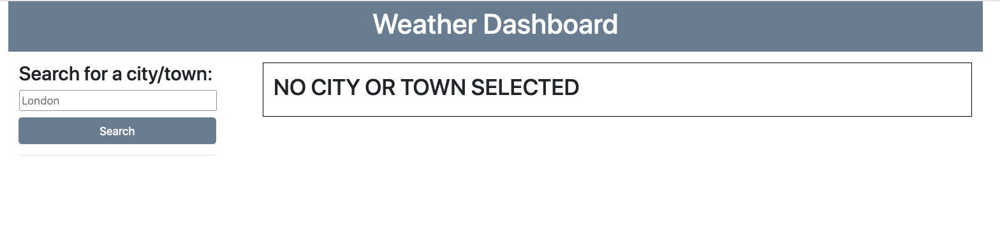
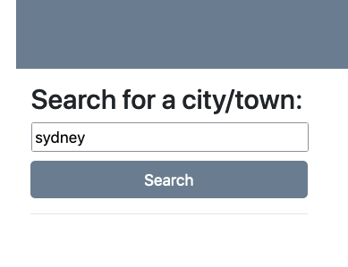
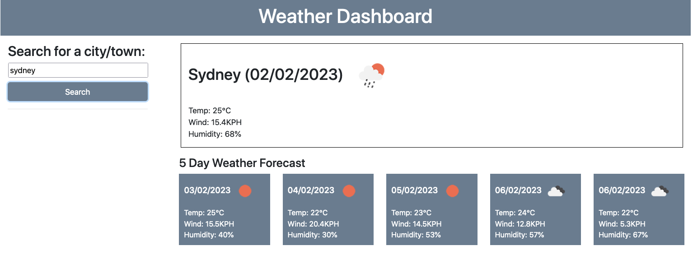
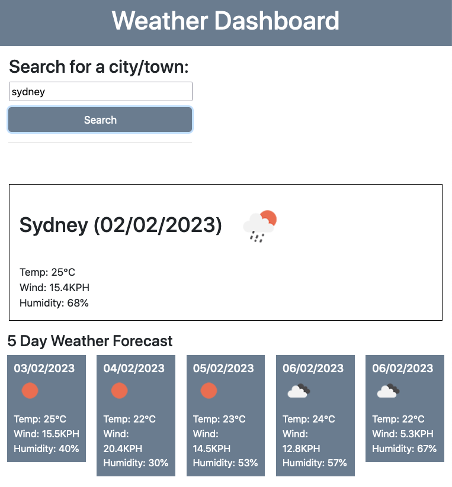

## Overview

Build a weather dashboard that will run in the browser and feature dynamically updated HTML and CSS.

Have a search area allowing the user to input town or city in search of weather.

Return current reults and a further 5 dya forecast.

Should display date, temperature, wind speed, humidity and a weather icon for each.

Store previous results as quick access buttons for user.

Make the page responsive and functional across screen sizes.

### Screenshot showing initial screen without any user interactions

  

### Screenshot showing user input which is free of choice (as long as well known city or town - challenge only required city) 

  

### Screenshot showing result of current data and 5 day forecast 

  

### Screenshot showing same page in responsive mode on smaller screens

  

### Links

- Repo URL: https://github.com/leedvine/weather-app
  
- Live Site URL: https://leedvine.github.io/weather-app

## My process

### Built with

- Use of OpenWeather API, Javascript, jQuery, moments.js, CSS (including Bootstrap) and HTML
  
### What I learned

APIs offer a world of access to 3rd party data
  
By setting variables to certain factors we can display specific results the API lets us find up on our screen for our users
  
### Useful resources
  
https://developer.mozilla.org/en-US/docs/Web/API
  
https://openweathermap.org/api
  
https://momentjs.com/
  
## Author
  Lee Vine
- GitHub - https://github.com/leedvine

## Installation

Simplest way to view the project is on GitHub pages here https://leedvine.github.io/weather-app

You can also download the files to your local environment from Github here https://github.com/leedvine/weather-app and right click the index file to open in browser.

It is also possible to download from the above link and instal on any hosting owned by yourself. Note this should only be done on unused / clean hosting account 

Installing in folders with the same name here can overwrite your existing files.

